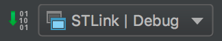
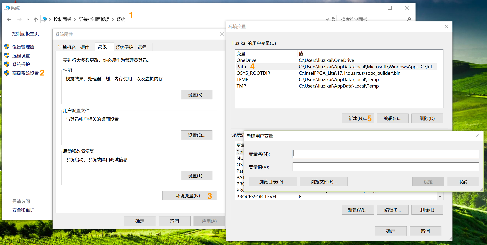
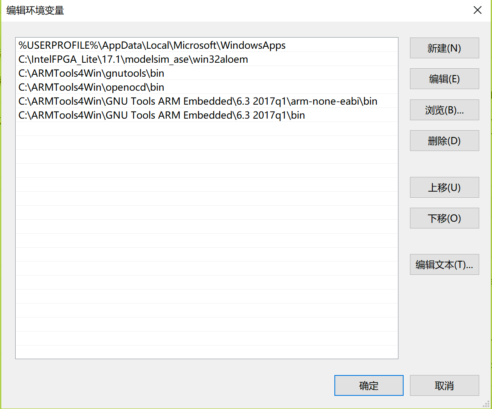

## Develop Environment Configuration

### Mac

#### 1. Install CLion
Register with ZJU email to get free student licenses.

[JetBrains](www.jetbrains.com)

#### 2. Install OpenOCD and compile toolchain(with HomeBrew)
```bash
brew install OpenOCD
brew tap PX4/px4
brew install px4-dev
```

#### 3. Download or clone this project

#### 4. Open the project with CLion
Just select the whole folder to open it. CLion will recognize the ```CMakeLists.txt```.

#### 5. Select "STLink | Debug" as build configuration


#### 6. Press "Build" on the left to compile and upload program.

### Win

#### 1. Install GNU Tools ARM Embedded, GNUTools(Make) and OpenOCD

1. Download Sharepoint\开发环境配置\Win\ARMTools4Win
2. Unzip and move the folder ARMTools4Win to a local directory (use ```C:\ARMTools4Win``` as example)
3. Set the following environment variables:
* ```C:\ARMTools4Win\gnutools\bin```
* ```C:\ARMTools4Win\openocd\bin```
* ```C:\ARMTools4Win\GNU Tools ARM Embedded\6.3 2017q1\arm-none-eabi\bin```
* ```C:\ARMTools4Win\GNU Tools ARM Embedded\6.3 2017q1\bin```





#### 2. Run ```compile_win.bat```
#### 2. Edit the code with external editor
